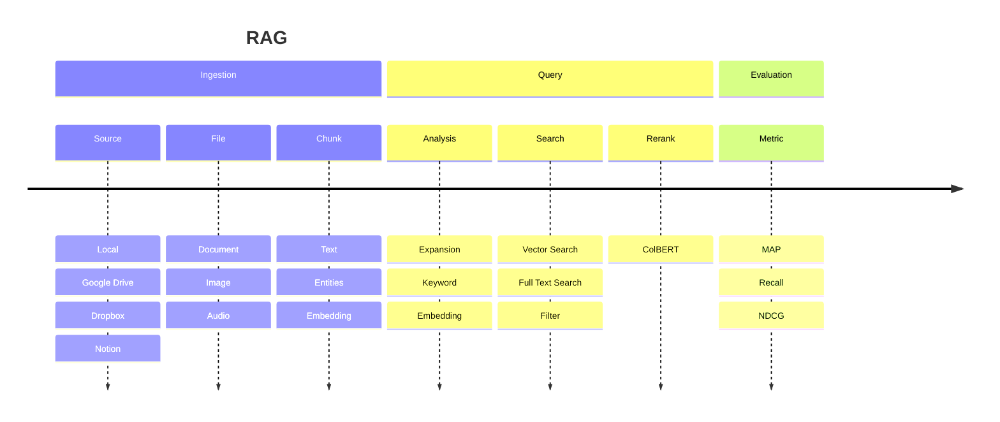

# vechord

Python RAG framework built on top of PostgreSQL and [VectorChord](https://github.com/tensorchord/VectorChord/).

## Diagram



## Examples

- [beir.py](./examples/beir.py): the most flexible way to use the library (loading, indexing, querying and evaluation)
- [web.py](./examples/web.py): build a web application with from the defined tables and pipeline
- [essay.py](./examples/essay.py): extract the content from Paul Graham's essays and evaluate the search results from LLM generated queries
- [contextual.py](./examples/contextual.py): contextual retrieval example

## Development

```bash
docker run --rm -d --name vechord -e POSTGRES_PASSWORD=postgres -p 5432:5432 tensorchord/vchord-postgres:pg17-v0.2.1
envd up
# inside the envd env, sync all the dependencies
make sync
# format the code
make format
```
