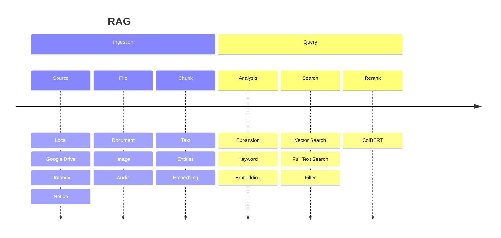

# vechord

Python RAG framework built on top of PostgreSQL and [VectorChord](https://github.com/tensorchord/VectorChord/).

## Diagram

```mermaid
timeline
    title RAG
    section Ingestion
        Source: Local
              : Google Drive
              : Dropbox
              : Notion
        File: Document
            : Image
            : Audio
        Chunk: Text
             : Entities
             : Embedding
    section Query
        Analysis: Expansion
                : Keyword
                : Embedding
        Search: Vector Search
              : Full Text Search
              : Filter
        Rerank: ColBERT
```
