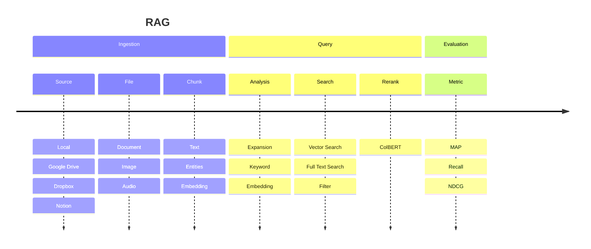

## Diagram

## Pipeline

- request type
  - text
    - chunk
    - index: embedding | keyword | graph
  - image | pdf
    - ocr => text
    - multimodal embedding
    - recognize => graph

- index type
  - vector => vchord
  - keyword => vchord-bm25
  - graph
    - Entity: vector
    - Relation: vector

- search
  - vector
  - keyword
  - graph

